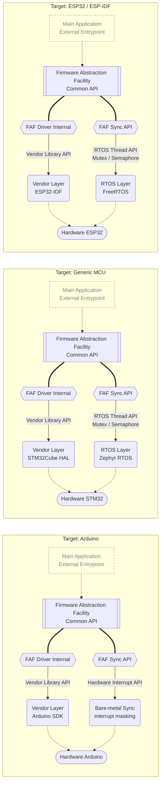

# Firmware Abstraction Facility (FAF)

This library provides an abstraction layer between hardware and application code, helping you write high-performance, decoupled firmware — so you don't have to rewrite the same logic for every different microcontroller.

## Architecture

The architecture is based on the **Hardware Abstraction Layer** (HAL) model, where users can create drivers for specific components following the library's expected interface, and use them in the application through the API each driver exposes.

Drivers are made available through a global list generated by a built-in **Domain-Specific Language** that resolves entirely at compile time, with no need for external scripts or equivalent tooling.

## Roadmap

### Alpha v0.0.1:
- [x] Basic module structure.
- [x] DSL for declarative configuration.
- [x] Core-lib unit tests on Desktop environment.
- [x] Usage examples for v0.0.1a.

### Current Plains:
- [x] Generic Calls Implemented - Drivers Refactored on New Dispatch System.
- [x] Total Refactor on Library Core to Fix Issues and Bottlenecks.
- [ ] Thread-Safety for full RTOS compatibility.
- [ ] Basic drivers for the native ESP32-IDF platform.

> **Status:** Stable Version in development - Branch `Dev` Active

## License
The released code is licensed under the MIT license.